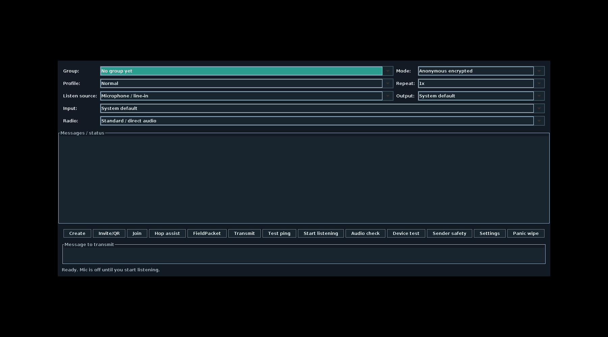

# DeadDrop

[](LICENSE)
[](https://github.com/custiecollector/dead-drop/releases/latest)

DeadDrop sends short text messages over sound. It turns a message into an audio packet, plays it through a speaker or audio path, and lets another device decode it through a microphone or demodulated PCM input.

DeadDrop is Android-first. A small Java desktop companion is included for Linux and Windows desktop use, audio diagnostics, QR import/export, and SDR/PCM receive paths.

DeadDrop is early software. Do not treat it as audited or production-ready.

## Why

DeadDrop is built for situations where devices may not have Internet access, accounts, phone numbers, or shared infrastructure. The transport is audio: direct speaker-to-mic, a wired audio path, radio audio, or a local SDR/virtual-audio pipeline.

## Current features

- Android app with no Internet permission.
- Linux/Windows desktop companion for protocol and audio use.
- Native Windows app image and per-user installer path.
- Anonymous encrypted group messages.
- Signed encrypted messages with a local handle.
- Signed plaintext messages for interoperability.
- Second-factor protected group invites.
- QR invite display and QR-image import on Android and desktop.
- Android Keystore-backed local storage.
- Auto-expiring local message board.
- Separate replay cache to suppress duplicate packets even when the visible log is cleared.
- Panic wipe for local groups, logs, replay state, and identity.
- Fast/Nearby, Normal, Robust+FEC, Voice Bridge/Narrowband, and Ultra/Noisy audio profiles.
- Peak/RMS/clipping diagnostics for microphone, line-in, and supported system-output capture paths.
- Radio mode presets for acoustic/no-cable, cabled, USB-interface, narrowband bridge, and SDR receive workflows.
- Manual Hop Assist that shows a deterministic shared channel schedule as an operator aid; it does not retune radios or SDRs.
- Desktop PCM-stdin decoder entry point for SDR or virtual-audio receive pipelines.
- System-output listening: Android 10+ AudioPlaybackCapture for allowed app/browser playback, Windows WASAPI loopback helper, and Linux Pulse/PipeWire monitor capture when `parec`/`pw-record` is available.
- Android generic USB SDR discovery/authorization plumbing without network permission.
- Desktop device test for speaker/microphone sanity checks.
- Local signed-sender safety fingerprints and key-change warnings.
- Desktop-only FieldPacket tools for FP1 compose/decode, APRS/AX.25 preview, and KISS/TNC hex helper workflows.

## Repository layout

```text
app/        Android application
desktop/    Java desktop companion for Linux/Windows
docs/       Protocol and security notes
packaging/  Desktop package/installer files
scripts/    Build, run, package, and SDR helper scripts
```

## Downloads

Public builds are distributed through GitHub Releases rather than committed into source history.

- Current release: [DeadDrop 0.1.12](https://github.com/custiecollector/dead-drop/releases/tag/v0.1.12).
- Android APK: [`DeadDrop-0.1.12-android.apk`](https://github.com/custiecollector/dead-drop/releases/download/v0.1.12/DeadDrop-0.1.12-android.apk).
- Linux desktop package: [`DeadDrop-0.1.12-linux-desktop.zip`](https://github.com/custiecollector/dead-drop/releases/download/v0.1.12/DeadDrop-0.1.12-linux-desktop.zip).
- Windows desktop package: [`DeadDrop-0.1.12-windows-desktop.zip`](https://github.com/custiecollector/dead-drop/releases/download/v0.1.12/DeadDrop-0.1.12-windows-desktop.zip).
- Windows installer: [`DeadDrop-Desktop-0.1.12-Setup.exe`](https://github.com/custiecollector/dead-drop/releases/download/v0.1.12/DeadDrop-Desktop-0.1.12-Setup.exe). Windows builds are not code-signed yet, so SmartScreen/unknown-publisher warnings are expected.
- Checksums: [`SHA256SUMS-0.1.12.txt`](https://github.com/custiecollector/dead-drop/releases/download/v0.1.12/SHA256SUMS-0.1.12.txt).

FieldPacket remains a standalone Android app with its own APK release. The DeadDrop Desktop Linux/Windows release includes a desktop FieldPacket tool suite, but DeadDrop Android and FieldPacket Android stay separate.

- Standalone FieldPacket for Android: [FieldPacket](https://github.com/custiecollector/Field-Packet/releases).


## Quick start

1. Download the current Android APK or desktop package from [GitHub Releases](https://github.com/custiecollector/dead-drop/releases/latest).
2. On Android, install the APK and create or join a group from the app's setup controls.
3. To send a short message, choose the group/profile, type the text, and tap **Transmit**.
4. To receive, open DeadDrop on the second device and tap **Start listening** before the sender transmits.

## UI preview




## Build Android

Requirements:

- JDK 17
- Android SDK, compile SDK 35
- Gradle 8.x

Build a local release APK:

```bash
gradle --no-daemon assembleRelease
```

Output:

```text
app/build/outputs/apk/release/app-release.apk
```

Package the local release APK and checksum:

```bash
./scripts/package_android.sh
```

Outputs:

```text
build/DeadDrop-<version>-android.apk
build/SHA256SUMS-<version>-android.txt
```

Release signing keys are not included. Public release APKs are published from signed release builds in GitHub Releases. To build your own signed release, copy `local.properties.example` to `local.properties` and add your own local keystore settings.

## Build the desktop companion

Linux/macOS/dev machine:

```bash
./scripts/build_desktop.sh
./build/deaddrop-desktop
```

Outputs:

```text
build/deaddrop-desktop.jar
build/deaddrop-desktop
build/deaddrop-windows.cmd
```

Compatibility aliases are also produced for the older `deaddrop-linux-gui` name:

```text
build/deaddrop-linux-gui.jar
build/deaddrop-linux-gui
```

## Package desktop builds

Cross-platform ZIP packages:

```bash
./scripts/package_desktop.sh
```

Outputs:

```text
build/DeadDrop-<version>-linux-desktop.zip
build/DeadDrop-<version>-windows-desktop.zip
build/SHA256SUMS-<version>-desktop.txt
```

Native Windows app and installer, from Windows PowerShell:

```powershell
powershell -NoProfile -ExecutionPolicy Bypass -File packaging\windows\build-windows-native.ps1 -InstallInno
```

Outputs:

```text
build\windows-native\app-image\DeadDrop Desktop\DeadDrop Desktop.exe
build\windows-native\installer\DeadDrop-Desktop-<version>-Setup.exe
build\deaddrop-<version>-desktop-windows-native.zip
build\SHA256SUMS-<version>-windows-native.txt
```

See [`docs/windows-desktop.md`](docs/windows-desktop.md).

The desktop companion uses a local passphrase-protected vault. Leaving the passphrase blank starts a temporary session that is not saved.

## Build checks

```bash
gradle --no-daemon assembleRelease
./scripts/build_desktop.sh
```

## Security notes

DeadDrop is designed for short offline messages. It does not hide that a transmission happened, prevent jamming, or protect a compromised device.

Read these before relying on it:

- [`docs/security.md`](docs/security.md)
- [`docs/threat-model.md`](docs/threat-model.md)
- [`docs/protocol.md`](docs/protocol.md)

## Radio and SDR audio paths

DeadDrop can use direct acoustic audio, wired audio, radio audio, or demodulated SDR/virtual-audio paths. See [`docs/radio-sdr-interfaces.md`](docs/radio-sdr-interfaces.md) for radio mode presets, recommended interface categories, and SDR PCM input guidance.

## License

Apache License 2.0. See [`LICENSE`](LICENSE).
